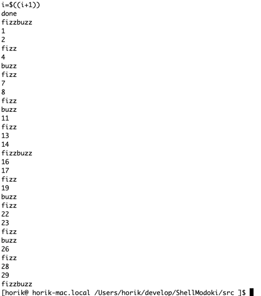

# ShellModoki
プログラミングの勉強のために書いた簡易的なシェルプログラムです．一応は，fizzbuzz
を実行するBashスクリプトを読み込んで実行するというところ目標として実装を進めました．
実装はすべてC言語によります．

# 実行方法
ソースコードは/srcの中にまとまっています．/srcの中にMakefileを置いており，これを
実行することでbuildされたバイナリが/binに配置されます．/bin/myshellが実行プログラム
になります．
このプログラムを実行すると，プロンプトが表示されるので，コマンド等を入力し
動作を確認します．

# 実装された機能

* コマンドの実行機能
    * fork()とexecvp()によってコマンドの実行をすることができます．

* 変数の定義
    * 変数名 = 値 という形式で変数を宣言することができます．

* 複数コマンドの実行
    * &&と||による複数コマンドの実行が可能です．

* プロンプトの情報表示
    * [ ユーザ名 @ マシン名 カレントディレクトリのパス ]$ という形式でプロンプト
     が表示されます

* if文
    * if-elif-else文による条件分岐が可能です．

* while文
    * while文による繰り返し処理が可能です．

* 算術演算
    * $(( 計算式 )) のフォーマットで算術演算が可能です．しかし()には非対応です． 

* historyコマンド
    * hisotryコマンドによって，コマンドの入力履歴を確認できます．

* cdコマンド
    * cdコマンドにより，ディレクトリの移動が可能です．

* exitコマンド
    * exitコマンドにより，プログラムを終了します．

# fizzbuzz 



以下のようなfizzbuzzスクリプト(bash)を入力することで，fizzbuzzが実行できます.
上画像のような出力結果が得られます．

```bash 
i=0
while [ $i -le 30 ]
do
    if [ $((i%15)) -eq 0 ]; then
        echo "FizzBuzz"
    elif [ $((i%3)) -eq 0 ]; then
        echo "Fizz"
    elif [ $((i%5)) -eq 0 ]; then 
        echo "Buzz"
    else
        echo $i
    fi
    i=$((i+1))
done

```

# ソースファイルの一覧

* arithmetic_calculator.c (.h)
    * 算術演算のためのプログラムです．

* debug_functions.c (.h)
    * デバッグ用の関数郡です．

* executor.c (.h)
    * 構文解析の結果を踏まえて，shellスクリプトを実行するプログラムです．

* history.c (.h)
    * historyコマンドを実装しているプログラムです．

* parse_tree_nodes.c (.h)
    * 構文解析木を構成するノード郡を定義しているプログラムです．

* parser.c (.h)
    * トークン列を受けて構文解析をするプログラムです．

* printer.c (.h)
    * プロンプトを画面に出力するプログラムです．

* shell_modoki.c (.h)
    * main プログラムです．

* symbol_table.c (.h)
    * 記号テーブルを実装しているプログラムです．

* tokenizer.c (.h)
    * ユーザ入力をトーカナイズするプログラムです．

